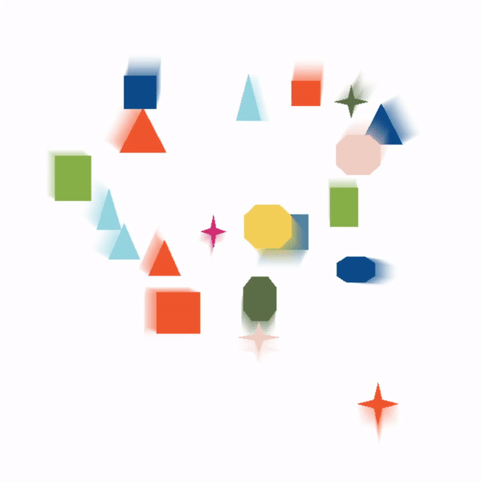

# OpenGL_ScreenSaver

OpenGL_ScreenSaver is a screen saver written in C++. Figures with random color, size, position and shape (square/triangle/star/octagon) appear on the canvas. After appearing a figure selects a target (another figure) and follows it. When they both collide they will be destroyed. The maximum number of shapes on the canvas is limited to 20.

Forked from [OpenGL_Figures](https://github.com/valerachuk/OpenGL_Figures)

## Technologies

- [glew](http://glew.sourceforge.net/)
- [glfw](https://www.glfw.org/)
- [glm](https://github.com/g-truc/glm)

## Demo

